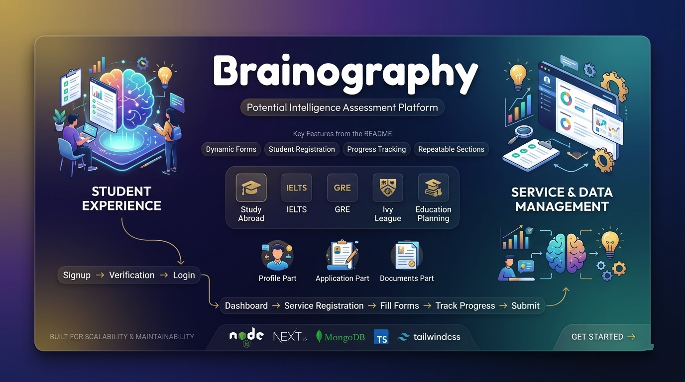

<div align="center">



# Brainography

### Potential Intelligence Assessment Platform

[](https://nodejs.org/)
[](https://nextjs.org/)
[](https://www.mongodb.com/)
[](https://www.typescriptlang.org/)
[](https://tailwindcss.com/)

A comprehensive platform for managing educational services with dynamic form generation, student registration, and progress tracking.

[Quick Start](#quick-start) • [Features](#features) • [Documentation](#documentation) • [Tech Stack](#tech-stack)

</div>

---

## What's New - Service Form System

This platform includes a complete **Service-based Dynamic Form System** that allows:

- **Multiple Services**: Study Abroad, IELTS, GRE, Ivy League, Education Planning
- **Dynamic Forms**: Forms generated from database structure
- **Student Registration**: Register for multiple services
- **Progress Tracking**: Visual progress indicators
- **Repeatable Sections**: Education history, work experience, program applications
- **Beautiful UI**: Modern, responsive design with gradients and animations

---

## Quick Start

### Prerequisites

- Node.js 18+ 
- MongoDB (local or Atlas)
- npm or yarn

### 1. Backend Setup

```bash
cd backend
npm install
npm run seed:forms   # Seed services and form structure
npm run dev          # Start server on port 5000
```

### 2. Frontend Setup

```bash
cd frontend
npm install
npm run dev          # Start Next.js on port 3000
```

### 3. Access the Application

| Service  | URL                      |
|----------|--------------------------|
| Frontend | http://localhost:3000    |
| Backend  | http://localhost:5000    |

---

## Features

### Authentication System
- Email-based signup with OTP verification
- Role-based access control (Student, Counselor, Alumni, Admin, etc.)
- JWT authentication
- Password reset functionality

### Service Management
- Multiple educational services
- Service registration system
- Service-specific forms
- Registration tracking

### Dynamic Form System
- 4-level hierarchy: Parts → Sections → SubSections → Fields
- 13 field types supported
- Repeatable sections (education, work, programs)
- Auto-save functionality
- Progress tracking
- File upload support

### Study Abroad Service (Fully Configured)
- **Profile Part**: Personal details, academic qualification, work experience, test scores
- **Application Part**: University and program selection
- **Documents Part**: Document upload management

---

## Tech Stack

<table>
<tr>
<td valign="top" width="50%">

### Backend
- Node.js + Express
- TypeScript
- MongoDB + Mongoose
- JWT Authentication
- Nodemailer

</td>
<td valign="top" width="50%">

### Frontend
- Next.js 16
- React 19
- TypeScript
- Tailwind CSS
- Axios

</td>
</tr>
</table>

---

## Database Structure

| Collection | Description |
|------------|-------------|
| `users` | User accounts |
| `services` | Available services |
| `formparts` | Reusable form parts |
| `serviceformparts` | Service-to-part mappings |
| `formsections` | Form sections |
| `formsubsections` | Form subsections |
| `formfields` | Individual fields |
| `studentserviceregistrations` | Student enrollments |
| `studentformanswers` | Form responses |

---

## User Journey

```
Sign Up → Email Verification → Login
    ↓
Dashboard → View Available Services
    ↓
Register for a Service (e.g., Study Abroad)
    ↓
Fill Forms → Profile, Application, Documents
    ↓
Track Progress → Visual Progress Indicators
    ↓
Complete → Submit Application
```

---

## Environment Variables

### Backend `.env`

```env
PORT=5000
MONGO_URI=your_mongodb_connection_string
JWT_SECRET=your-jwt-secret
JWT_EXPIRES_IN=7d
EMAIL_ADDRESS=your_email
EMAIL_PASSWORD=your_email_password
EMAIL_VERIFICATION_URL=http://localhost:3000/verify-email
PASSWORD_RESET_URL=http://localhost:3000/reset-password
```

### Frontend `.env.local`

```env
NEXT_PUBLIC_API_URL=http://localhost:5000/api
```

---

## Documentation

| Document | Description |
|----------|-------------|
| [Quick Start Guide](QUICK_START_GUIDE.md) | Get up and running in 10 minutes |
| [System Documentation](SERVICE_FORM_SYSTEM_DOCUMENTATION.md) | Complete technical documentation |
| [System Architecture](SYSTEM_ARCHITECTURE.md) | Visual diagrams and data flows |
| [Implementation Summary](IMPLEMENTATION_SUMMARY.md) | What was built and features |
| [Project Summary](PROJECT_SUMMARY.md) | Authentication system details |
| [Environment Setup](ENVIRONMENT_SETUP.md) | Environment configuration |

---

## Security Features

- JWT-based authentication
- Role-based authorization
- Password hashing with bcrypt
- Email verification
- Input validation
- Unique compound indexes

---

## UI/UX Highlights

- Modern gradient designs
- Smooth animations
- Responsive layout
- Loading states
- Toast notifications
- Progress indicators
- Intuitive navigation

---

## What's Included

- Complete authentication system
- 5 pre-configured services
- Study Abroad form (80+ fields)
- Dynamic form renderer
- Progress tracking
- Beautiful UI components
- Comprehensive documentation

---

## Future Enhancements

- [ ] Payment integration
- [ ] Parent/Counselor views
- [ ] Admin panel
- [ ] Email notifications
- [ ] Analytics dashboard
- [ ] Mobile app

---

## License

ISC

---

<div align="center">

**Built with modern web technologies for scalability and maintainability.**

[Get Started](QUICK_START_GUIDE.md)

</div>
